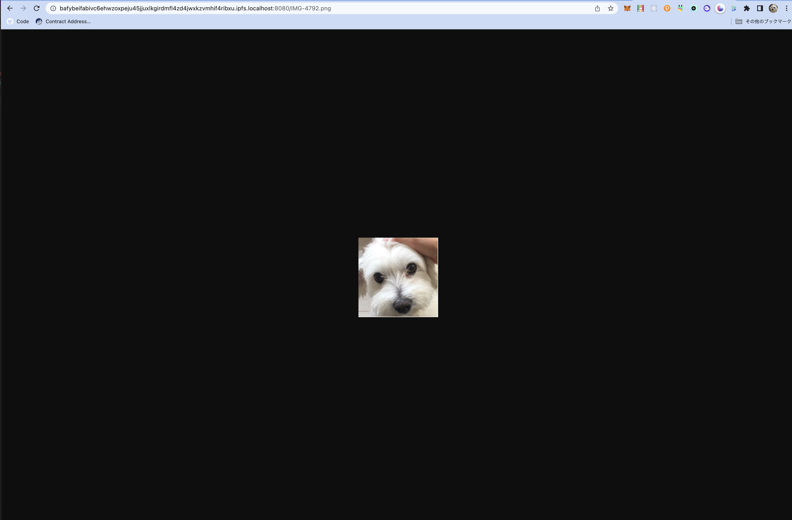

# MyNFTMaker
コンテンツを分散型ストレージにアップロードしてNFTを作成するアプリのリポジトリです。

### デプロイ用のコマンド
 1. `npx hardhat run scripts/run.js`
 2. `npx hardhat run scripts/deploy.js`

### 発行したNFTの例
 <a href="https://testnets.opensea.io/assets/mumbai/0x5e86a9f80e4dec74573fe75f62090cb28a1b5760/1">こちら</a>

### IPFSにアップロードした画像
 

### Munbaiにデプロイしたコントラクトのアドレス
  0x970F75E1295314A78b317E3f27c8d6353BEF009D